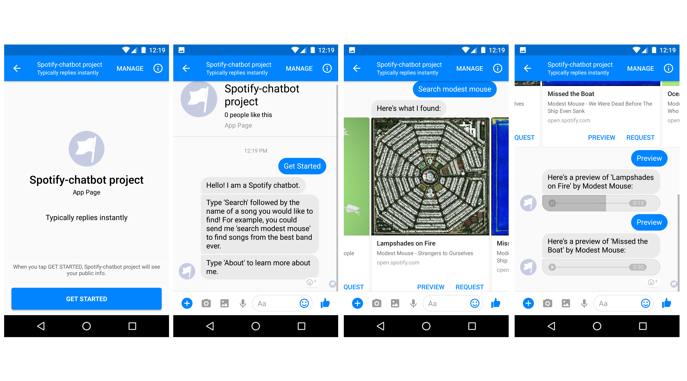

# Facebook Chatbot with Spotify Integration
## Current Features
##### v0.2
- users can become hosts: the app logs into Spotify, creates a new playlist and assigns the host a passcode
- other users can request for a song to be added to a host's playlist using the host's passcode, or cancel their request
- hosts can preview requested songs and approve them, which adds the song to the playlist and notifies the requester
##### v0.1
- search for songs
- listen to 30-second previews, if available

## Screenshots
##### v0.2



## Setup
##### Part 1: Heroku
1. Make an Heroku account and install Heroku tools from https://devcenter.heroku.com/articles/heroku-cli
2. Install Node from https://nodejs.org/en/, and initiate a Node project
    ```
    npm init
    ```
3. Install Node dependencies from npm-shrinkwrap.json
4. Set up Git and push to Heroku instance
    ```
    git init
    git add .
    git commit -m "Initial commit"
    heroku create
    git push heroku master
    ```
##### Part 2: Facebook
1. Create a Facebook page for your app at https://developers.facebook.com/apps/
2. Click on "Messenger" under "Products". Generate a token under "Token Generation", and set up Webhook under "Webhooks". Use the URL of your Heroku server as your webhook URL (append "/webhook/" to the end)
3. Save as Config Variables on Heroku
    ```
    heroku config:set FB_REDIRECT_URI=your-redirect-uri
    heroku config:set FB_TOKEN=your-fb-token
    ```
##### Part 3: Spotify
1. Create a Spotify application at https://developer.spotify.com/my-applications/#!/applications
2. Go to your application settings and add the URL of your Heroku server as your redirect URI (append "/callback/" to the end). Also take note of your Client ID and Client Secret.
3. Save as Config Variables on Heroku
    ```
    heroku config:set SPOTIFY_CLIENT_ID=your-client-id
    heroku config:set SPOTIFY_CLIENT_SECRET=your-client-secret
    heroku config:set SPOTIFY_REDIRECT_URI=your-redirect-uri
    ```
4. With all this set up, you should be good to go! Message your Facebook page to try it out. Note that until your application gets submitted for review and accepted, other users will have to be added as testers before the bot will respond to them.